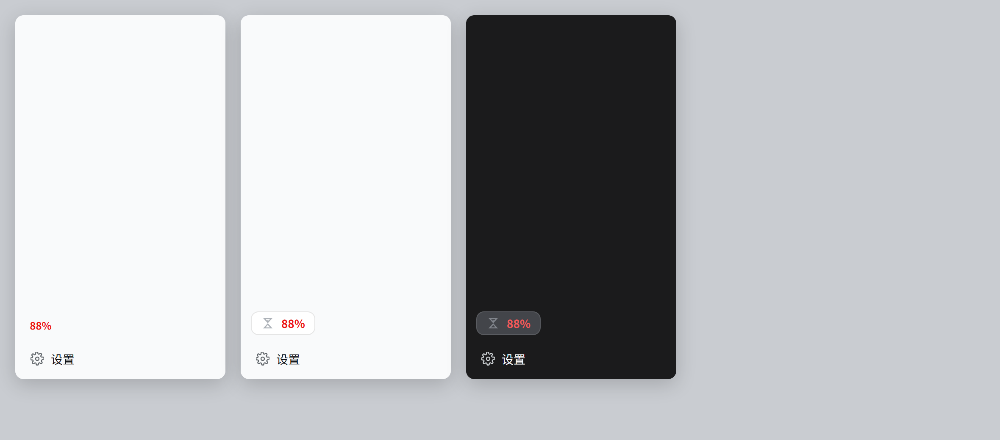
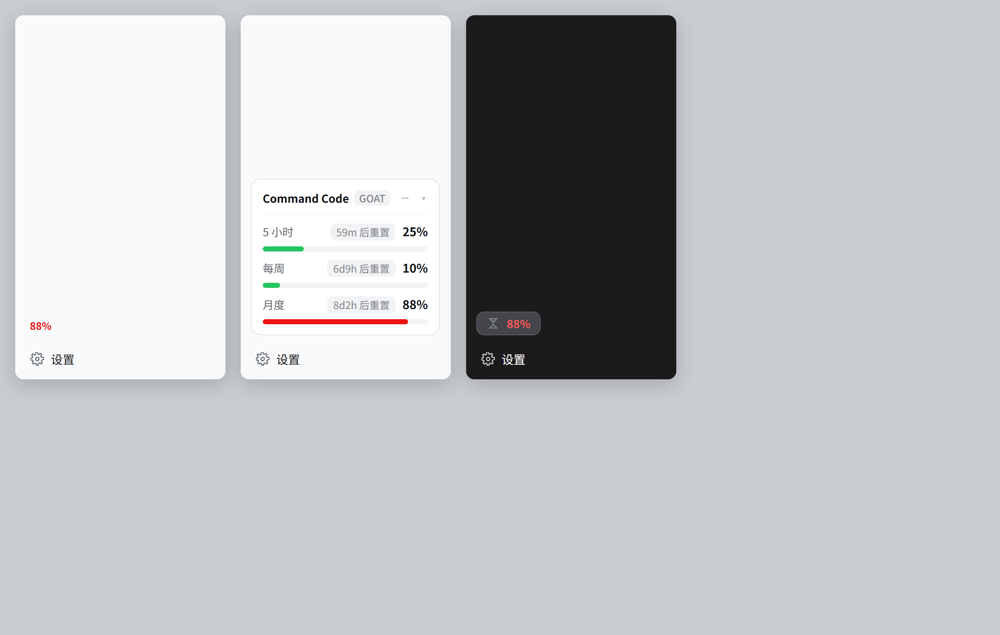

# dsh-commandcode-quota（最小化 UI 改进版）

Command Code 套餐额度面板 —— DeepSeek Harness 侧栏里的额度卡片。

**这是 [Jovan1666/commandcode-usage](https://github.com/Jovan1666/commandcode-usage) 的改进版**，只改了 `client.js` 一个文件，加上「默认折叠成小芯片、点击展开」的行为。

> 上游原始文档保留在 [`README.md`](README.md) / [`README.zh-CN.md`](README.zh-CN.md)，未做改动。

## 效果

| 默认（折叠） | 展开 |
| --- | --- |
|  |  |

侧栏里默认只占「沙漏图标 + 百分比」的宽度，不再是一条满宽卡片。

## 改动内容（相对上游，仅 `client.js`，共 5 处）

1. **默认最小化** —— 宽侧栏下只显示 28px 高的紧凑芯片（`.ccq-pill`）：沙漏图标 + 最紧张窗口的整百分比，沿用红/黄/绿分级色。宽度按内容自适应（`flex:none` + `inline-flex`，不再是 `width:100%`），所以右侧不会留空条。套餐名与各窗口精确读数移到悬停 tooltip。
2. **点击展开** —— 点图标条展开为完整面板（窗口行、进度条、重置倒计时、明细、账单链接），行为与上游一致。
3. **再收回去** —— 面板头部新增「–」按钮，点击收起；按 <kbd>Esc</kbd> 也可以。`▾` 的明细展开行为保持原样。
4. **错误可见性** —— 读取失败且无可用报告时，图标条显示红色「!」，tooltip 带错误摘要，展开后可见原有错误卡片。
5. **其余不变** —— 折叠侧栏（rail）的圆形徽章、设置面板的「模型调用次数」章节、轮询节奏、`/quota` 命令、host 端（`index.js` / `quota.mjs`）完全未动。

改动逐项说明见 [`README-MODIFIED.md`](README-MODIFIED.md)。

## 安装

```sh
dsh plugin --profile desktop add github:LimiChan-2026/dsh-plugins#path:/packages/dsh-commandcode-quota
```

装完**完全退出并重开** DeepSeek Harness，然后刷新页面。

> `dsh` 在 Windows 桌面版里不在 PATH 上，位于
> `<安装目录>\resources\runtime\cli\bin\dsh.cmd`。

### 卸载 / 换回上游原版

```sh
# 卸载
dsh plugin --profile desktop remove dsh-commandcode-quota

# 或换回上游原版
dsh plugin --profile desktop add github:Jovan1666/commandcode-usage#path:/plugins/dsh
```

## 与上游的关系

| 项 | 说明 |
| --- | --- |
| 上游 | <https://github.com/Jovan1666/commandcode-usage>（`plugins/dsh`） |
| 本版 | 仅 `client.js` 不同；其余文件与上游**逐字节一致**（已校验） |
| 许可证 | MIT，沿用上游 |
| 署名 | 原作者 Jovan1666；本仓库仅发布 UI 改动 |

**升级上游时请注意**：本包不会自动跟随上游更新。若上游有重要修复，需要手动取来新版本文件，再把本版 `client.js` 的 5 处改动重新应用一遍。

## 本目录包含什么

| 路径 | 说明 |
| --- | --- |
| `index.js` / `quota.mjs` / `catalog.mjs` | host 端，与上游一致 |
| `catalog.seed.json` | 内置模型目录种子（`catalog.mjs` 会读取） |
| `client.js` | **浏览器端，本版的改动所在** |
| `cli/` | 独立的 `ccq` 命令行工具 |
| `cordis.patch.yml` | `dsh.bundle.patch` 层，供 CLI 安装路线使用 |
| `docs/` | 三张状态截图 |
| `README-MODIFIED.md` | 改动说明与回滚方式 |

不含上游仓库里的 `preview/`（预览生成产物）与 `tools/`（本地开发脚本）—— 那些体积大且非运行时必需。

## 已知限制

- **需要 Command Code 账号凭据**。没有配置 Command Code provider 时，卡片不显示（不会报错）。
- 本包声明了 `react` / `react-dom` 依赖，但 DSH 的浏览器端从自带的冻结模块表提供 React，实际不会重复安装。
